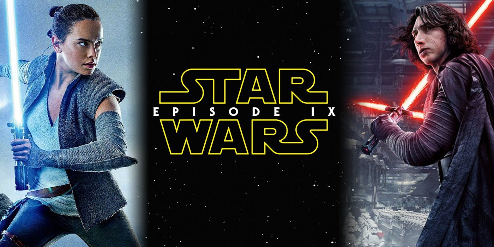

hello world
# Star Wars  
### In a galaxy far...far...away

**The FIRST ORDER reigns**. Having decimated the peaceful Republic, Supreme Leader Snoke now deploys his merciless legions to seize military control of the galaxy.   
### Only _**General Leia Organa's**_ band of _RESISTANCE_ fighters stand against the rising tyranny, certain that **Jedi Master Luke Skywalker** will return and restore a spark of hope to the fight.     
  ### But the Resistance has been exposed. As the First Order speeds toward the rebel base, the brave heroes mount a desperate escape....

The Resistance had to fight in:
* Jakku  
* Crait  
* Canto Bright


>**Their biggest enemies**:   
1. Kylo Ren
  2. General Hux   
3. Captain Phasma


[Star Wars](https://www.oxigenio.fm/wp-content/uploads/2019/04/star-wars-episode-9.jpg)

 

```<html><h1> 1</h1></html>```

External Links
www.google.com

Internal links [Julien](../../../julien)


# Anchors in Markdown 
[link to an anchor](#anchors-in-markdown)


:sleepy:
# checkboxes
- [x] buy groceries
- [ ] cook the lasagne
- [ ] eating

# Table

|Real Name|Alice| Bob| Carl|
|-|-|-|-|
|Nick Name|al   |Spongebob|CJ|
|phone numbers|123456  |345672|76573927|
|Hometown|Argentina   |Brazil|Canada|